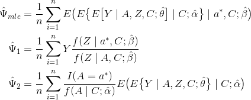

# frontdoorpiie

A package for estimation and inference of the
Population Intervention Indirect Effect (PIIE) using 
the four estimators described in Fulcher et. al (2017). 


## Installation


```r
devtools::install_github("isabelfulcher/frontdoorpiie")
```

## Description
This package only contains one function `piieffect`. This function provides
estimation and inference of the Population Intervention Indirect Effect (PIIE). 
The PIIE can be interpreted as the contrast that relates the marginal outcome 
of the target population to the outcome mean had contrary to fact had the intermediate variable taken its corresponding value in the absence of exposure. The output for the function returns estimates, standard errors, and a 95\% Wald-type confidence interval 
for each of the four estimators described in Fulcher et al. (2017): 




## Data format 

### Data
A dataframe containing the outcome, exposure, intermediate, and all covariates should be created. All of these variables should be numeric. The column names for each of these variables is necessary for the function.

### Outcome model 
The outcome variable Y must be a continuous variable as it will be modeled with linear regression using the `lm()` function:


If an interaction term is not needed, the argument should be `interaction=0`. Additonally, the argument for the covariates in the outcome model should be specified in `covariates.outcome=c("covariate_1","covariate_2")`. If no covariates are needed, then this argument can be left blank or `covariates.outcome=0` can be used. No interaction terms between the exposure or intermediate and covariates are currently allowed. If interaction terms are desired between covariates, this should be created outside of the function (see example).

### Intermediate model
The intermediate variable Z must be a continuous variable as it will be modeled with linear regression using the `lm()` function:


The argument for the covariates in the intermediate model should be specified in `covariates.intermediate=c("covariate_1","covariate_2")`. If no covariates are needed, then this argument can be left blank or `covariates.intermediate=0` can be used. No interaction terms between the exposure and covariates are currently allowed. If interaction terms are desired between covariates, this should be created outside of the function (see example).

### Exposure model 
The exposure variable A must be a binary variable as it will be modeled with logistic regression using the `glm()` function:


The argument for the covariates in the exposure model should be specified in `covariates.exposure=c("covariate_1","covariate_2")`. If no covariates are needed, then this argument can be left blank or `covariates.exposure=0` can be used. If interaction terms are desired between covariates, this should be created outside of the function (see example). 

## An example 

### Load example dataset
```r
simdata <- readRDS(system.file("rds","simdata1.rds",package="frontdoorpiie"))
```
### View example dataset
```r
head(simdata)
```
### Create an interaction term between covariate 1 and covariate 2 
```r
simdata$c1c2 <- simdata$c1*simdata$c2
```
### Apply `piieffect` function to estimate PIIE
```{r,echo=TRUE}
piieffect(data=simdata,outcome="y",intermediate="m",exposure="a",
  covariates.outcome=1,covariates.intermediate=c("c1"),covariates.exposure=c("c1","c2","c1c2"),
  interaction=1,astar=0)
```
